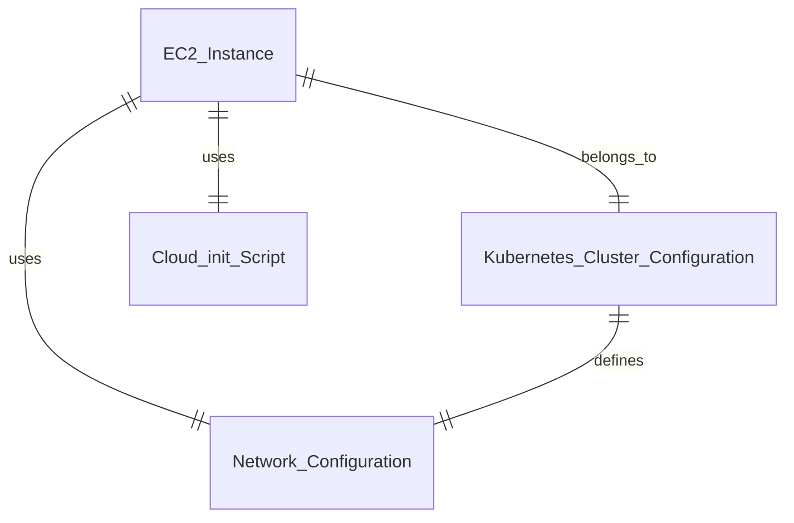

# Data Model: Kubernetes Cluster Foundation

**Created**: 2025-08-24  
**Purpose**: Define data entities and their relationships for the Kubernetes cluster

## Core Entities

### 1. EC2 Instance

**Description**: Virtual machines that form the Kubernetes cluster nodes

**Attributes**:
- `instance_id`: string - AWS EC2 instance identifier
- `instance_type`: string - EC2 instance type (t3.small or t3.micro)
- `role`: enum - CONTROL_PLANE | WORKER
- `availability_zone`: string - AWS AZ placement
- `private_ip`: string - Private network address
- `public_ip`: string - Public address (control plane only)
- `security_group_ids`: array[string] - Associated security groups
- `subnet_id`: string - VPC subnet placement
- `iam_instance_profile`: string - IAM role for the instance
- `user_data`: string - Cloud-init configuration script
- `tags`: map[string]string - Resource tags

**Validation Rules**:
- Exactly 1 instance with role = CONTROL_PLANE
- Exactly 2 instances with role = WORKER
- Control plane must have public IP
- Workers must not have public IP

### 2. Kubernetes Cluster Configuration

**Description**: Cluster-wide configuration settings

**Attributes**:
- `cluster_name`: string - Kubernetes cluster identifier
- `kubernetes_version`: string - Kubernetes version to install
- `pod_network_cidr`: string - IP range for pod networks (10.244.0.0/16)
- `service_network_cidr`: string - IP range for services (10.96.0.0/12)
- `cluster_domain`: string - DNS domain for cluster (cluster.local)
- `control_plane_endpoint`: string - API server access point
- `join_token`: string - Token for worker nodes to join cluster
- `ca_cert_hash`: string - Certificate hash for join verification

**Validation Rules**:
- pod_network_cidr must not overlap with VPC CIDR
- service_network_cidr must not overlap with pod_network_cidr
- join_token must be generated during control plane initialization

### 3. Cloud-init Script

**Description**: Bootstrap configuration for EC2 instances

**Attributes**:
- `script_type`: enum - CONTROL_PLANE | WORKER
- `content`: string - YAML configuration content
- `packages`: array[string] - Required packages to install
- `services`: array[string] - Services to enable and start
- `commands`: array[string] - Commands to execute during boot
- `files`: map[string]string - Files to create on instance

**Validation Rules**:
- Control plane script must include kubeadm init command
- Worker script must include kubeadm join command
- All scripts must install container runtime and Kubernetes components

### 4. Network Configuration

**Description**: Network settings for cluster communication

**Attributes**:
- `vpc_id`: string - VPC identifier from Spec 001
- `subnet_ids`: array[string] - Subnet identifiers for instance placement
- `security_group_rules`: array[object] - Security group ingress/egress rules
- `cni_provider`: string - Container Network Interface provider (flannel)
- `network_backend`: string - Network backend type (vxlan)
- `pod_network_port`: number - UDP port for VXLAN (4789)

**Validation Rules**:
- All security groups must allow necessary Kubernetes ports
- VXLAN port must be open on all nodes
- Control plane must allow API server access

## Entity Relationships

## State Transitions

### EC2 Instance Lifecycle

1. **PENDING** → **RUNNING**: Instance boots and executes cloud-init
2. **RUNNING** → **CLUSTER_INITIALIZING**: cloud-init starts kubeadm
3. **CLUSTER_INITIALIZING** → **CLUSTER_READY**: Node joins cluster successfully
4. **CLUSTER_READY** → **TERMINATING**: Instance shutdown initiated

### Cluster Bootstrap Flow

1. **INFRASTRUCTURE_PROVISIONED**: Terraform creates EC2 instances
2. **CONTROL_PLANE_INITIALIZING**: Control plane runs kubeadm init
3. **WORKERS_JOINING**: Workers use join command to connect
4. **CNI_INSTALLING**: Flannel CNI deployed on all nodes
5. **CLUSTER_OPERATIONAL**: All nodes ready, networking functional

## Data Flow

### Bootstrap Process

1. Terraform provisions EC2 instances with cloud-init scripts
2. Control plane instance:
   - Installs container runtime and Kubernetes components
   - Runs kubeadm init to create cluster
   - Generates join token and certificate hash
   - Deploys Flannel CNI
3. Worker instances:
   - Install container runtime and Kubernetes components
   - Use join command to connect to control plane
   - Register as cluster nodes
4. Cluster becomes operational with all nodes ready

### Output Generation

- Control plane IP address for API access
- kubeconfig file for cluster administration
- Join command details (for manual verification)
- Instance details for validation

## Validation Constraints

### Resource Limits
- Maximum 3 EC2 instances (1 control plane, 2 workers)
- Instance types limited to t3.small and t3.micro
- EBS volume size fixed at 20GB per instance

### Network Constraints
- Must use VPC and subnets from Spec 001
- Pod network CIDR: 10.244.0.0/16
- Service network CIDR: 10.96.0.0/12
- VXLAN backend for Flannel

### Security Constraints
- Control plane accessible via SSH and API server
- Workers accessible only via SSH
- All inter-node communication encrypted
- IAM roles manually provisioned per constitution