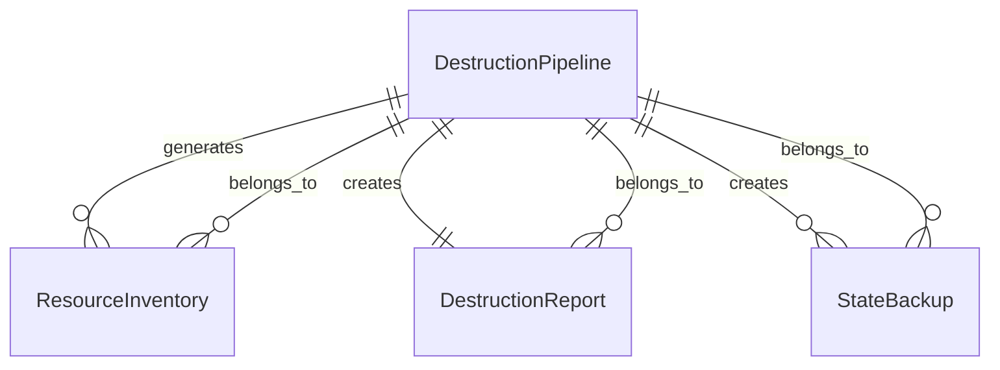
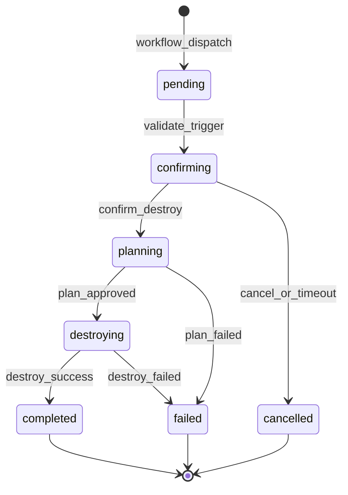
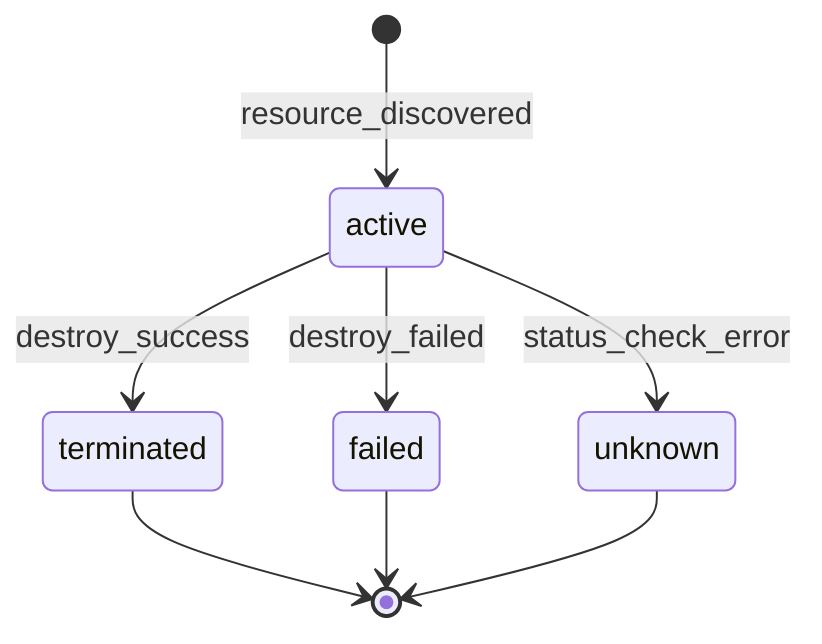

# Data Model - Destroy Pipeline

**Feature**: 004-destroy-pipeline  
**Date**: 2025-08-25

---

## Core Entities

### 1. DestructionPipeline

The main workflow entity that orchestrates the destruction process.

**Attributes**:
- `workflow_id`: Unique identifier for GitHub Actions run
- `triggered_by`: GitHub username who initiated destruction
- `environment`: Target environment (always "dev" for this feature)
- `status`: Current state of the pipeline
- `started_at`: Timestamp when destruction began
- `completed_at`: Timestamp when destruction completed (if applicable)

**States**:
- `pending`: Initial state after trigger
- `confirming`: Waiting for user confirmation
- `planning`: Running terraform plan -destroy
- `destroying`: Executing terraform destroy
- `completed`: Destruction finished successfully
- `failed`: Destruction failed
- `cancelled`: User cancelled during confirmation window

**Validation Rules**:
- `environment` must be "dev" (enforced by workflow)
- `triggered_by` must have valid GitHub authentication
- Transition from `confirming` to `planning` requires explicit confirmation

---

### 2. ResourceInventory

Represents the inventory of resources that will be or have been destroyed.

**Attributes**:
- `inventory_id`: Unique identifier for the inventory
- `pipeline_id`: Reference to the destruction pipeline
- `generated_at`: Timestamp when inventory was created
- `resource_type`: Type of AWS resource (ec2, vpc, security_group, etc.)
- `resource_id`: AWS resource identifier
- `resource_name`: Terraform resource name
- `environment_tag`: Environment tag value (should be "dev")
- `status`: Resource status (active, terminated, unknown)

**Resource Types**:
- `aws_instance`: EC2 instances
- `aws_vpc`: Virtual Private Clouds
- `aws_subnet`: VPC subnets
- `aws_security_group`: Security groups
- `aws_internet_gateway`: Internet gateways
- `aws_ebs_volume`: EBS volumes
- `aws_s3_bucket`: S3 buckets (excluded from destruction)

**Validation Rules**:
- `environment_tag` must be "dev" for resources to be destroyed
- S3 buckets with state storage are excluded from destruction
- Resources without environment tags are flagged for manual review

---

### 3. DestructionReport

Represents the final report generated after destruction completion.

**Attributes**:
- `report_id`: Unique identifier for the report
- `pipeline_id`: Reference to the destruction pipeline
- `generated_at`: Timestamp when report was created
- `total_resources`: Total number of resources in inventory
- `destroyed_resources`: Number of successfully destroyed resources
- `failed_resources`: Number of resources that failed to destroy
- `partial_destruction`: Boolean indicating if destruction was incomplete
- `cost_savings`: Estimated monthly cost savings (optional)

**Report Sections**:
- `summary`: High-level overview of destruction results
- `destroyed_list`: List of successfully destroyed resources
- `failed_list`: List of resources that failed to destroy
- `warnings`: Any warnings or issues encountered
- `recommendations`: Follow-up actions if needed

**Validation Rules**:
- `destroyed_resources + failed_resources <= total_resources`
- `partial_destruction` is true if `failed_resources > 0`
- Report must be generated even if destruction fails

---

### 4. StateBackup

Represents a backup of the Terraform state file.

**Attributes**:
- `backup_id`: Unique identifier for the backup
- `pipeline_id`: Reference to the destruction pipeline
- `created_at`: Timestamp when backup was created
- `backup_location`: Storage location (GitHub Actions artifact URL)
- `backup_size`: Size of backup file in bytes
- `checksum`: SHA256 checksum of backup file
- `retention_days`: Number of days to retain backup

**Backup Types**:
- `pre_destruction`: State backup before destruction begins
- `post_destruction`: Final state backup after destruction

**Validation Rules**:
- `checksum` must be calculated and verified
- `retention_days` must be at least 90 (per SC-003)
- Backup must be successfully created before destruction proceeds

---

## Data Relationships



---

## State Transitions

### Destruction Pipeline State Machine



### Resource Inventory Status Flow



---

## Input/Output Data Structures

### Workflow Input (GitHub Actions)
```yaml
inputs:
  environment:
    description: 'Target environment to destroy'
    required: true
    type: choice
    options:
      - dev
  confirm_destroy:
    description: 'Type "destroy" to confirm'
    required: true
    default: ''
```

### Inventory Output (JSON)
```json
{
  "inventory_id": "inv-123456",
  "pipeline_id": "pipeline-789012",
  "generated_at": "2025-08-25T10:00:00Z",
  "resources": [
    {
      "resource_type": "aws_instance",
      "resource_id": "i-1234567890abcdef0",
      "resource_name": "module.kubernetes.aws_instance.control_plane",
      "environment_tag": "dev",
      "status": "active"
    }
  ],
  "summary": {
    "total_resources": 10,
    "by_type": {
      "aws_instance": 3,
      "aws_vpc": 1,
      "aws_subnet": 2,
      "aws_security_group": 4
    }
  }
}
```

### Destruction Report Output (Markdown)
```markdown
# Destruction Report - dev

**Pipeline ID**: pipeline-789012  
**Generated**: 2025-08-25T10:30:00Z  
**Requested by**: github-username  

## Summary
- Total Resources: 10
- Destroyed: 9
- Failed: 1
- Status: Partial Destruction

## Destroyed Resources
- aws_instance.control_plane (i-1234567890abcdef0)
- aws_instance.workers[0] (i-0987654321fedcba0)
- [7 more resources...]

## Failed Resources
- aws_security_group.node_access (sg-12345678) - Error: DependencyViolation

## Recommendations
1. Manually review and clean up remaining security group
2. Verify no orphaned EBS volumes remain
3. Check AWS console for any missed resources
```

---

## Validation Rules Summary

### Business Rules
1. Only dev environment can be destroyed
2. Explicit confirmation required before destruction
3. S3 state bucket must never be destroyed
4. All destruction operations must be logged
5. State backup must be created before destruction

### Technical Rules
1. Terraform plan must be successful before destroy
2. State file checksum must be verified
3. Resource inventory must match Terraform plan
4. Failed destruction must be reported with details
5. Pipeline must complete within GitHub Actions timeout

### Security Rules
1. Only authenticated users can trigger destruction
2. OIDC role must have destruction permissions
3. All operations must use least-privilege access
4. Sensitive data must not be logged
5. Audit trail must be maintained for 90 days